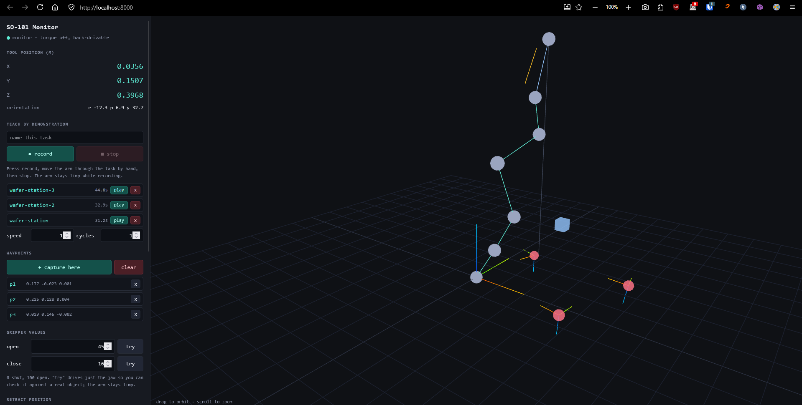

# SO-101 Robot Arm

Control software for an [SO-101](https://huggingface.co/docs/lerobot/so101) arm
(6x Feetech STS3215 servos) on Windows: a browser GUI with live 3D view,
Cartesian control with our own inverse kinematics, waypoint sequences, and
teach-by-demonstration.

---

## Quickstart

Plug in **both** the USB cable and the **12V barrel jack** — USB powers the
controller board's logic but not the servos, and the arm is silent without it.

```powershell
cd C:\hf\automation\so101
. .\activate.ps1
python server.py
```

That opens <http://localhost:8000> automatically. Torque starts **off**, so the
arm is limp and safe to move by hand.

Prefer not to activate the environment? Call the interpreter directly:

```powershell
.venv\python.exe server.py
```

Useful flags:

```powershell
python server.py --http-port 8080 --rate 60 --no-browser
python server.py --port COM4 --id arm0        # different serial port / calibration
```

> [!NOTE]
> There is **no npm or build step**. The front end is a single static
> `web/index.html` served by `server.py`, and three.js is vendored at
> `web/vendor/`. "Run the app" means "run the Python server".

If it will not connect, jump to [Troubleshooting](#troubleshooting) — the two
usual causes are the 12V supply being off and a previous server still holding
the serial port.

---

## What this is

A single arm, no leader, so there is no teleoperation. Everything is driven
either from the browser or from small command-line scripts.

Defaults throughout: serial port **COM3**, robot id **arm0** (which selects
`~/.cache/huggingface/lerobot/calibration/robots/so_follower/arm0.json`).

Built on [LeRobot](https://github.com/huggingface/lerobot) 0.6.1 for servo I/O
and calibration, but the kinematics, motion planning and GUI are all local —
see [Why not lerobot's solver](#why-not-lerobots-solver).

## Repo layout

| File | Purpose |
| --- | --- |
| [server.py](server.py) | Web GUI server: monitor, waypoint sequences, demonstrations |
| [web/index.html](web/index.html) | The whole front end — three.js view plus controls |
| [kinematics.py](kinematics.py) | URDF-driven forward and inverse kinematics, numpy only |
| [arm.py](arm.py) | Connect, read, interpolated moves, servo tuning |
| [demos.py](demos.py) | Storage and playback maths for recorded demonstrations |
| [move_ee.py](move_ee.py) | CLI: move the tool to an XYZ, open/close the gripper |
| [pick_place.py](pick_place.py) | CLI: shuttle an object between hard-coded positions |
| [move_middle.py](move_middle.py) | CLI: send every joint to its calibrated midpoint |
| [scan_bus.py](scan_bus.py) | CLI: report which motor IDs and baud rates are live |
| [urdf/](urdf/) | Official SO-101 URDF from TheRobotStudio/SO-ARM100 |
| [requirements.txt](requirements.txt) | Pinned dependency set |
| [activate.ps1](activate.ps1) | Dot-source to activate `.venv` |

Not tracked (gitignored): `.venv/`, `waypoints.json`, `recordings/`. The last
two are your data, not project content.

---

## The web GUI



*The UI as of 24 September 2026: monitor mode with three saved demonstrations,
three captured waypoints, and the 3D view showing the arm skeleton, waypoint
markers with orientation triads, and the blue retract cube.*

Two modes, and the arm is stiff in only one of them:

| Mode | Torque | What happens |
| --- | --- | --- |
| **monitor** (default) | **off** | Back-drive by hand; readout and 3D view follow |
| **running** | **on** | Plays back a sequence or a demonstration; red banner across the view |

It always returns to monitor with torque off when a run ends, aborts, or fails.

The left panel shows live tool position and orientation, all six joint angles
with range bars, and a log. The 3D view draws the arm skeleton, **both gripper
jaws**, a drop line to the table, a trail of recent tool positions, and markers
for your waypoints. Drag to orbit, scroll to zoom.

### Waypoint sequences

Three things: a **list of points**, a **pair of gripper values** (one open, one
close, for the whole sequence), and a **retract position**.

1. Move the gripper by hand to where you want a point.
2. **+ capture here** records the tool XYZ *and* its orientation.
3. Set the **open** and **close** gripper values. **try** drives just the jaw so
   you can check a value against a real object, leaving the arm limp.
4. Back-drive somewhere clear and press **set retract here**.
5. Set **cycles**, then **run (torque ON)**. **stop** aborts mid-motion.

Each point is visited **twice** — once to open, once to close — retracting after
each:

```
-> retract (start)
cycle 1/1: p1
  -> p1 ... open (85) ... -> retract
  -> p1 ... close (12) .. -> retract
cycle 1/1: p2
  -> p2 ... open (85) ... -> retract
  -> p2 ... close (12) .. -> retract
```

Retract moves never touch the gripper: after closing on an object the arm has to
lift away still holding it.

Playback **refuses to start** without a retract position, and every point plus
the retract is IK-checked before torque is enabled — so an unreachable target
aborts while the arm is still limp.

State persists to `waypoints.json`:

```json
{
  "retract": [0.25, 0.0, 0.22],
  "gripper_open": 85.0,
  "gripper_close": 12.0,
  "match_orientation": true,
  "waypoints": [
    {"name": "p1", "xyz": [0.22, -0.1, 0.1], "quat": [0.49, 0.21, 0.84, -0.1]}
  ]
}
```

### Teach by demonstration

Show the arm a task by hand, then have it repeat it. Separate from waypoints:
waypoints are discrete poses you choose, a demonstration is a continuous
trajectory you perform.

1. Type a name, press **● record**. Torque is released.
2. Move the arm through the whole task by hand, gripper included.
3. Press **■ stop**. Saved under `recordings/`.
4. Press **play**. Set **speed** (0.1–4x) and **cycles** first.

Recordings are captured in **joint space**, deliberately. What you physically
showed the arm *is* a joint trajectory, so replaying those angles reproduces it
exactly. Going via Cartesian would mean solving IK every frame, which can pick a
different elbow configuration, wander near a singularity, or fail outright on a
pose the demonstration passed through happily.

All six joints are captured at 30 Hz. Raw samples are stored; the moving-average
smoothing (`demos.SMOOTH_WINDOW`, ~0.23s) is applied at replay, so changing the
window cannot degrade an existing recording.

Replay eases into the demo's first pose over 2s before starting the clock, since
the arm may be nowhere near where the demonstration began.

---

## Command-line tools

```powershell
python scan_bus.py COM3                     # which motor ids/baud rates answer
python move_middle.py --dry-run             # read every joint, command nothing
python move_middle.py                       # all joints to calibrated midpoint
python move_ee.py --show                    # current joints + tool position
python move_ee.py --xyz 0.25 0.0 0.20       # move the tool there
python move_ee.py --gripper open            # open | close | half | 0-100
python pick_place.py                        # hard-coded shuttle (config at top of file)
```

Coordinates are metres in `base_link`: **+X forward** out of the base, **+Z up**,
origin at the base plate. `move_ee.py --show` is the quick way to get bearings.

---

## How it works

### Kinematics

[kinematics.py](kinematics.py) drives the official URDF
([urdf/so101_new_calib.urdf](urdf/)). Every revolute joint in that file has local
axis `(0,0,1)`, so each link transform is `Translate(xyz) @ RPY(rpy) @ RotZ(q)`
and forward kinematics is a plain product of 4x4s.

Two solvers, both damped least squares with random restarts:

- **Position IK** (`ik`) — 3 constraints on 5 joints. Validated over 300 random
  reachable targets: 291/300 converge, **max error 0.34 mm** (the rest hit the
  iteration cap, still sub-millimetre).
- **Pose IK** (`ik_pose`) — position *and* orientation, 6x5 Jacobian. Five joints
  cannot hit an arbitrary 6-DOF pose, but poses *captured from the arm* always
  can, which is exactly how waypoints are made. 300/300 converge, **max 0.10 mm
  and 0.52 deg**. Position is weighted above orientation so it wins where a pose
  is not exactly attainable.

The arm has 5 positioning joints but position is only 3 constraints, so solutions
form a 2-parameter family. Both solvers seed from the current pose and apply a
nullspace pull toward it, so successive calls stay near each other instead of
picking wildly different elbow configurations.

### Why not lerobot's solver

`lerobot.model.kinematics.RobotKinematics` needs
[`placo`](https://pypi.org/project/placo/), which does not work on Windows. This
was checked properly, not assumed:

| Route | Result |
| --- | --- |
| `pip install placo` | No Windows wheels exist — PyPI has only `macosx_*` and `manylinux_*`. Source build fails on `eiquadprog`. |
| conda-forge | Native `win-64` builds **do** exist and install cleanly with pinocchio/eigenpy/eiquadprog. |
| ...but importing it | `ImportError: DLL load failed while importing placo: The specified procedure could not be found.` |
| Versions 0.9.17–0.9.20 | All four fail identically. |
| In a pristine env (only python + placo) | Still fails — so it is the conda-forge Windows build, not a local conflict. |

If you ever want real placo, WSL is the route: the manylinux wheels install with
plain pip. You would then need `usbipd` to get COM3 across the WSL boundary.

> [!WARNING]
> Do not `conda install placo` into `.venv`. It pulls conda's MKL-backed numpy
> over the pip one, and MKL then collides with the copy torch ships: every
> `np.linalg.solve` **hard-crashes the interpreter** with no traceback. Recover
> with `.venv\python.exe -m pip install --force-reinstall --no-deps numpy==2.2.6`.

### Frame conventions

`shoulder_pan` carries `rpy="3.14159 0 -3.14159"` in the URDF, a 180-degree flip.
**Positive pan moves the tool toward −Y.** FK and IK agree with each other, so
the maths is consistent — just do not expect pan sign to match a naive
right-handed reading of the base frame.

`gripper` is not part of the kinematic chain. It only opens and closes the jaw,
so it never affects where the tool point is. lerobot's 0–100 maps linearly onto
the URDF joint limits; measured, the jaw tip travels 25 mm from the tool point at
0 to 120 mm at 100, confirming **0 = closed, 100 = open**.

### Server architecture

No dependencies beyond the standard library plus vendored three.js.

- **Transport** is Server-Sent Events for the live stream (Python → browser) and
  plain `POST /api` for commands the other way.
- **One thread owns the robot.** A serial port is exclusive, so the poller holds
  the connection and HTTP handlers hand it commands through a `queue`. Playback
  runs *inside* that thread, publishing state as it interpolates, which is why
  the 3D view animates during a run.
- **`abort` bypasses the queue** and sets an `Event` directly — queued behind a
  running sequence, a stop button would be useless.
- **Forward kinematics stays in Python.** The browser receives already-computed
  3D points for the skeleton and both jaws and just draws them. Nothing about the
  URDF is reimplemented in JavaScript.
- The camera is set `up = (0,0,1)`: the URDF is Z-up, three.js defaults to Y-up.

---

## Measured behaviour

### Jitter

The arm is visibly rough during motion. Measured by sweeping one joint and taking
the RMS of the high-frequency part of its velocity on a fixed 100 Hz analysis
grid (resampling first, so encoder quantisation at short intervals cannot
masquerade as roughness).

**Raising the command rate does not help.** This was the obvious hypothesis — 30
Hz goals to a position-mode servo ought to stair-step — and it is wrong:

| Command rate | Goal step | Roughness (deg/s) |
| --- | --- | --- |
| 30 Hz | 0.67 deg | 2.2 |
| 60 Hz | 0.33 deg | 2.5 |
| 120 Hz | 0.17 deg | 2.4 |
| 200 Hz | 0.10 deg | 3.0 |

Flat, slightly worse at the top. The bus could take it — 569 Hz for commands, 307
Hz for a full read-and-command loop — the rate simply is not the bottleneck.
**At rest the arm is rock steady**: 0.000 deg position noise holding a fixed goal,
so this is not control-loop hunting either.

**Servo acceleration is the one real software lever.** lerobot writes
`Acceleration = Maximum_Acceleration = 254`, the maximum, so every goal is chased
flat out:

| Acceleration | Roughness (deg/s) | Lag (deg) |
| --- | --- | --- |
| 254 (lerobot default) | 3.2 | 1.23 |
| 96 | 2.6 | 1.05 |
| 24 | 2.4 | 0.88 |
| 12 | 2.2 | 0.75 |

Backing it off is ~25% smoother *and* tracks better. `arm.tune_servos()` applies
`Acceleration = 24`, `D = 0` on connect — it must run *after* `robot.connect()`,
since lerobot's own `configure()` resets acceleration to maximum every time.

**What is left is mechanical.** Rate does nothing, gains do nothing, it holds
perfectly still at rest, and the best tuning still leaves ~2.2 deg/s. That
signature — rough only while moving, silent when stopped — is stick-slip and lash
in the 1/345 plastic gearboxes, which no amount of software will remove.

One thing that genuinely helps: **approach every point from the same direction**.
Backlash is hysteresis, so consistent approach makes the error repeatable even
though it does not make it smaller. The retract-then-approach shape already does
this.

### Replay lookahead

Position-mode servos trail a moving target by a roughly fixed time, so demo
replay reads the trajectory slightly ahead to cancel it. Measured on a 6s sweep,
mean error across all six joints:

| Lookahead | Mean lag | Worst |
| --- | --- | --- |
| 0.00s | 2.09 deg | 9.29 |
| 0.05s | 1.52 deg | 7.19 |
| 0.10s | 1.01 deg | 5.57 |
| 0.15s | 0.70 deg | 5.31 |

`server.REPLAY_LOOKAHEAD` defaults to **0.10s** — a measured 2x improvement,
staying short of the best value tested since a hand demonstration has sharper
reversals than the smooth sweep this was tuned on.

### How far to trust the model

The URDF describes an ideal SO-101. Whether it matches *this* arm depends on the
calibrated zero lining up with the URDF's zero pose. Comparing the calibrated
sweep against the URDF limits:

| Joint | Calibrated span | URDF span | |
| --- | --- | --- | --- |
| `shoulder_pan` | 210.5 deg | 220.0 deg | close |
| `shoulder_lift` | 202.5 deg | 200.0 deg | close |
| `elbow_flex` | 193.8 deg | 193.7 deg | near exact |
| `wrist_flex` | 206.5 deg | 190.0 deg | over-swept ~16 deg |
| `wrist_roll` | 360.0 deg | 320.0 deg | **swept a full turn** |

The three joints that set tool position agree closely, which is why Cartesian
targets land where they should — measured tracking error moving to
`(0.25, 0, 0.20)` was **4 mm**, mostly gravity droop rather than model error.

Two caveats:

- **`wrist_flex`** was swept ~16 deg wider than the URDF allows, so its zero may
  be off by up to ~8 deg.
- **`wrist_roll`** was swept a full 360 deg, so its midpoint — and therefore its
  zero — is essentially arbitrary.

Neither affects tool *position*. Both affect tool *orientation*, so re-calibrate
the wrists against a physical reference before relying on orientation matching.

---

## Safety behaviour

Shared in [arm.py](arm.py) so every entry point inherits it:

- On connect, the present pose is immediately re-asserted as the goal, so a stale
  `Goal_Position` left in the servos cannot yank the arm.
- All motion is interpolated with smoothstep easing, never stepped.
- `max_relative_target` (default 12 deg) caps how far a goal may lead the measured
  position. The **gripper is exempt** — it is geared slowly and a cap tight enough
  for the arm throttles the jaw on every step.
- Every motion commands all six motors, holding the ones it is not moving.
- Targets below `z = 0.02 m` are refused by `move_ee.py` unless `--allow-low`.
- IK residual over 5 mm is treated as unreachable and refuses to move.
- Joint-space interpolation is deliberate: a straight-line Cartesian path can
  cross a singularity, so the tool traces an arc instead.

> [!NOTE]
> A run ends by disabling torque so you can back-drive again. The arm is usually
> up at the retract point when that happens, so it will **drop** from there. Put
> the retract somewhere a fall is harmless, or catch it.

---

## Setting up from scratch

Already done on this machine — this section is for a rebuild or a second arm.

### Environment

LeRobot targets **Python 3.12**. Conda's base interpreter here is 3.14, ahead of
what the torch wheels support, so create the env with an explicit 3.12:

```powershell
conda create -y -p .\.venv python=3.12
.\.venv\python.exe -m pip install -r requirements.txt
```

`.venv` is a conda environment at a path prefix, not a `python -m venv` venv, so
it has no `Scripts\activate.ps1` of its own — use [activate.ps1](activate.ps1),
which assumes conda at `%USERPROFILE%\anaconda3`.

Verified working set: Python 3.12.13, lerobot 0.6.1, feetech-servo-sdk 1.0.0,
pyserial 3.5, torch 2.11.0, numpy 2.2.6.

### Hardware bring-up

1. **Find the port** — `lerobot-find-port` lists ports and asks you to unplug the
   arm. With one adapter present it is moot; this machine uses COM3
   (`USB-Enhanced-SERIAL CH343`).

2. **Check whether the motors are already configured** — `python scan_bus.py COM3`.
   Motor IDs live in each servo's EEPROM, so a second-hand arm may already be
   done. IDs 1–6 at 1000000 baud means skip to calibration.

3. **Set motor IDs and baud rates** (only if needed):

   ```powershell
   lerobot-setup-motors --robot.type=so101_follower --robot.port=COM3
   ```

   Prompts for one motor at a time in reverse joint order, `gripper` first.
   **Exactly one motor may be connected at each prompt** — every servo ships with
   ID 1 and the bus is half-duplex, so two motors sharing an address collide. Do
   not build the chain up incrementally: lerobot picks whichever motor answers
   first and only validates the *model* number, so a partially-linked chain can
   silently overwrite an already-configured motor's ID.

4. **Calibrate**:

   ```powershell
   lerobot-calibrate --robot.type=so101_follower --robot.port=COM3 --robot.id=arm0
   ```

   Centre every joint, press Enter, then move each joint through its full range.
   Calibration is **not** stored in the motors — it is a JSON file on this PC at
   `HF_LEROBOT_CALIBRATION/robots/so_follower/<id>.json`.

### Motor map

Identical for leader and follower: `1 shoulder_pan`, `2 shoulder_lift`,
`3 elbow_flex`, `4 wrist_flex`, `5 wrist_roll`, `6 gripper`.

---

## Troubleshooting

**Nothing responds, but the COM port exists.** The port comes from the USB-serial
chip on the controller board, which is USB-powered — its presence says nothing
about the servos. Check the **12V supply** first, then the 3-pin cable, then the
Waveshare B-channel jumpers.

**`Could not connect on port 'COM3'` / `ConnectionError`.** The port is already
held by another process — usually an earlier `server.py` still running. Serial
ports are exclusive on Windows. lerobot's message tells you to run
`lerobot-find-port`, which sends you after the wrong problem. Find the holder:

```powershell
Get-CimInstance Win32_Process -Filter "Name LIKE '%python%'" |
    Select-Object ProcessId, CommandLine
Stop-Process -Id <pid> -Force
```

`pkill` from Git Bash does **not** reliably kill these — use `Stop-Process`.

**`connect attempt 1/3 failed (bus glitch)`.** The Feetech bus drops the odd
status packet, most often right after a process was killed mid-transaction.
Startup retries 3 times, 3s apart, and the poll loop absorbs transient failures
during monitoring — only 25 consecutive failures are fatal. If it happens on
*every* attempt rather than occasionally, suspect the 12V supply or a marginal
3-pin connection.

**Gripper will not hold an object.** The follower caps gripper torque at 50% and
`Overload_Torque` at 25% to avoid burning the servo out. An
`[RxPacketError] Overload error!` on id 6 means it stalled — back the target off
rather than raising the limits.

**Only ID 1 shows up with the whole chain connected.** Expected for unconfigured
motors — they are all colliding on address 1. Run `lerobot-setup-motors`.

**`lerobot-find-port` crashes with an EOF error.** It is interactive and needs a
real terminal; it cannot run piped or from a script.
